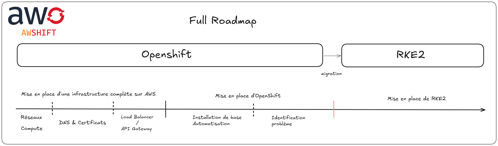

# Projet AWS + OpenShift

## Qui sommes-nous ?
**L'Équipe**
- Evan Verite
- Mathieu Pheron
- Maxence Lancosme

*Notre parcours de l'intention à la réalisation*

## Le Point de Départ

Tout a commencé avec une ambition claire : déployer une infrastructure Kubernetes robuste et automatisée sur AWS. Notre vision initiale ? Utiliser OpenShift comme socle de notre infrastructure cloud-native.

### Le Projet Initial : OpenShift sur AWS

![Infrastructure OpenShift]
*Notre première architecture, ses promesses et ses limites*

#### Les Défis Rencontrés
Rapidement, nous avons buté sur des obstacles techniques majeurs :
- Une image Fedora obsolète et non maintenue
- Une complexité de configuration réseau
- Des ressources surdimensionnées 
- Une approche de déploiement trop rigide

Ces contraintes nous ont forcés à repenser notre stratégie. Et si notre solution idéale n'était pas là où on la cherchait ?

## La Transformation : Vers RKE2

Notre pivot stratégique est né de la nécessité d'une solution plus légère, plus agile et mieux adaptée à nos besoins réels.

![Infrastructure RKE2]
*Notre nouvelle architecture, plus simple et plus puissante*

### Pourquoi RKE2 ?
RKE2 n'était pas qu'un changement technique, mais une transformation philosophique de notre approche :
- Une distribution Kubernetes sécurisée et certifiée
- Une compatibilité native avec AWS
- Une simplicité de déploiement et de maintenance
- Une communauté active et engagée

### Les Points Clés de Notre Nouvelle Architecture

#### Infrastructure Réseau
- VPC dédié avec segmentation claire
- Sous-réseaux publics et privés stratégiquement pensés
- Sécurisation maximale des points d'entrée

#### Compute Strategy
- Cluster Kubernetes hautement disponible
- Nodes control plane répartis sur plusieurs zones
- Workers en auto-scaling
- Bastion comme point d'orchestration unique

## Notre Approche Technique

### Infrastructure as Code
Nous avons mis en place une approche IaC rigoureuse avec :
- Terraform pour le provisionnement AWS
- Ansible pour la configuration du cluster
- Une automatisation complète du déploiement

### Outillage et Déploiement
Notre bastion devient le point central de notre infrastructure :
- Exécution des scripts Terraform
- Configuration via Ansible
- Point unique de gestion et de déploiement

### Sécurité et Résilience
- Accès verrouillé via bastion
- Communication chiffrée
- RBAC Kubernetes strict
- Haute disponibilité multi-AZ

## Ce Que Nous Avons Appris

Notre projet n'est pas qu'une histoire de technologie, mais de résilience et d'adaptation :
- La capacité à remettre en question nos choix initiaux
- L'importance de la simplicité dans l'architecture cloud
- La valeur d'une approche pragmatique plutôt que dogmatique

## Perspectives

Nous ne nous arrêtons pas là. Notre feuille de route inclut :
- Optimisation continue de l'infrastructure
- Mise en place de mécanismes de monitoring
- Amélioration de nos scripts d'automatisation
- Documentation et partage de notre expérience

## Conclusion

Un projet cloud réussi n'est pas un aboutissement, mais un voyage d'apprentissage constant.

**Merci**

*Des questions ?*